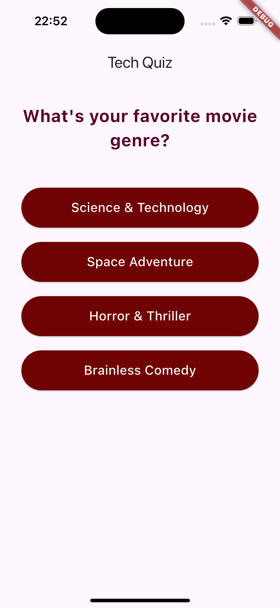
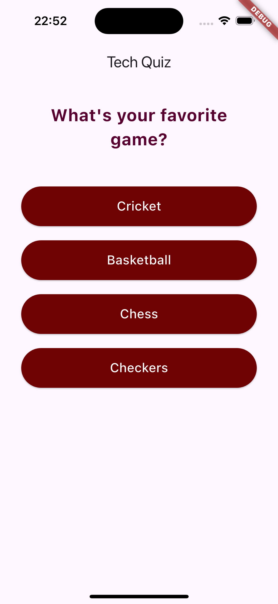
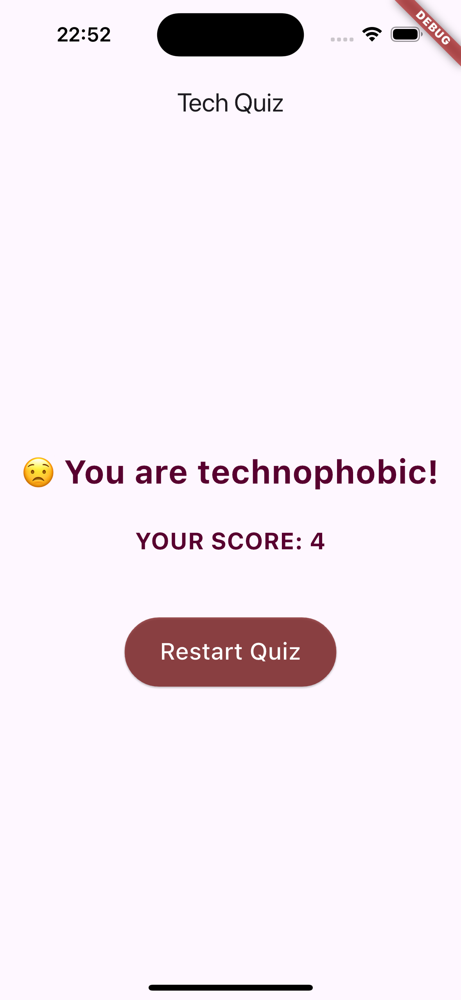

# Quiz Application

A Flutter-based quiz application with several modern UI improvements and fixes.

---

## ✨ Key Changes

1. **Modernized Buttons**
    - Rounded corners and better padding for both **Answer** and **Restart** buttons.

2. **Enhanced Spacing**
    - Used `SizedBox` and `EdgeInsets` for clean spacing between UI components.

3. **Dynamic Feedback**
    - Added emojis to the result phrase for better user engagement (e.g., 🎉, 🙁).

4. **Improved Readability**
    - Increased font sizes and used bold styles for important text.

---

## ❗ Issues Addressed

### 1. **Color Hexcode Format**
Flutter uses a hex format as `0xAARRGGBB`, where:
- `AA` is the alpha channel (transparency).
- `RR` is the red channel.
- `GG` is the green channel.
- `BB` is the blue channel.

#### Why `0xFF`?
- The `FF` in `0xFF` ensures the color is fully opaque.
- To adjust transparency, modify the alpha value (e.g., `0x806F0202` for 50% transparency).

---

### 2. **UI Spacing and Padding**
Maintaining consistent padding and spacing for the **Answer Box** was crucial. The `EdgeInsets` and `SizedBox` utilities were utilized to improve visual balance and alignment.

---

## 📸 Data Screenshots

Below are some screenshots showcasing the application's key features and improvements:

**Answer Buttons with Enhanced Padding and Rounded Corners**  

**Dynamic Feedback with Emojis**  

**Result Screen with Improved Spacing and Readability**  

---

